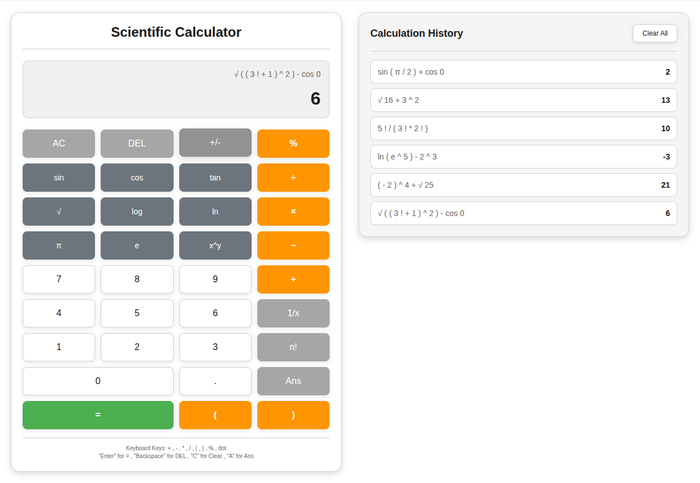

# Scientific Calculator

## Overview

This project is an assessment implementing modular, extensible scientific calculator built with TypeScript. It supports a wide range of arithmetic and scientific operations, including trigonometric, logarithmic, and power functions. The codebase is designed with object-oriented principles and loose coupling, making it easy to maintain, extend, and test.

## Features

- **Basic Arithmetic:** Addition, subtraction, multiplication, division, modulus.
- **History:** Save, Clear or Use previously evaluated Expression.
- **Scientific Functions:** Trigonometric (sin, cos, tan), logarithmic (log, ln), square root, power, factorial.
- **Constants:** π (PI), e (Euler's number).
- **Parentheses Support:** Nested and complex expressions.
- **Unary Operators:** Negation, reciprocal, toggle sign.
- **Calculation History:** Persistent history using localStorage.
- **Keyboard Shortcuts:** Full keyboard support for input and actions.
- **Theme Toggle:** Light/Dark mode.
- **Error Handling:** Graceful handling of invalid input, math errors, and malformed expressions.
- **Extensible:** Easily add, remove, or modify operators and functions.

## System Workflow

1. **User Input:** User enters an expression via UI or keyboard.
2. **Tokenization:** The input string is converted into tokens (numbers, operators, functions, constants, brackets) by the Tokenizer.
3. **Parsing:** The Parser converts the token stream into Reverse Polish Notation (RPN) using the shunting-yard algorithm, validating structure and precedence.
4. **Evaluation:** The Evaluator computes the result from the RPN tokens using a stack-based approach.
5. **Display & History:** The result is displayed and saved to history. Errors are shown with user-friendly messages.

**Workflow Diagram:**

```
[User Input]  →  [Tokenizer]  →  [Parser](RPN)  →  [Evaluator]  →  [Controller]  →  [UI]
```

## How to Run

1. **Clone the Repository:**

   ```bash
   git clone <repository-url>
   cd Calculator_Ts
   ```

2. **Install Dependencies:**

   ```bash
   npm install
   ```

3. **Build TypeScript:**

   ```bash
   npm run build
   ```

   - This runs `tsc -p tsconfig.build.json` and emits JavaScript to `dist/`, plus declarations and source maps.

4. **Optional Watch Build:**

   ```bash
   npm run watch
   ```

   - Rebuilds on file changes for faster local development.

5. **Serve Locally:**

   ```bash
   npm run serve
   ```

   - Starts `http-server` on port `8080` and serves from project root.
   - Open `http://localhost:8080` in your browser.

6. **Open directly (no server):**
   - You can also open `index.html` directly in a browser, but `serve` is recommended to avoid CORS/path issues with modules.

## Project Structure

```
project-root/
│
├── index.html
├── README.md
├── tsconfig.json
├── tsconfig.build.json
├── package.json
|
├── src/
│   ├── index.ts
│   │
│   ├── calculator/
│   │   ├── calculator.ts
│   │   ├── evaluator.ts
│   │   ├── history.ts
│   │   ├── operations.ts
│   │   ├── parser.ts
│   │   └── tokenizer.ts
│   │
│   ├── controller/
│   │   └── calculatorController.ts
│   │
│   ├── types/
│   │   ├── controller.types.ts
│   │   ├── history.types.ts
│   │   ├── operations.type.ts
│   │   ├── tokens.type.ts
│   │   └── index.ts
│   │
│   └── utils/
│       ├── stack.ts
│       └── index.ts
│
├── assets/
│   ├── light-theme.png
│   └── dark-theme.png
│
└── styles/
    └── style.css
```

## Extending the Calculator

### Adding a New Operator or Function

1. **Edit `src/calculator/operations.ts`:**
   - Add a new entry to the `operators` or `functions` Map.
   - Example (adding XOR operator):
     ```typescript
     operators.set("⊕", {
       lexerString: "⊕",
       tokenString: "xor",
       precedence: 1,
       associativity: "left",
       arity: 2,
       execute: (a: number, b: number) => a ^ b,
     });
     ```
   - For functions, use the same pattern in the `functions` Map.

2. **Update the UI (Optional):**
   - Add a button in `index.html` and handle it in `src/controller/calculatorController.ts` if you want UI access.

### Modifying Operators/Functions

1. **Edit the relevant entry in `src/calculator/operations.ts`** to change precedence, associativity, or implementation.

## Modularity & Loose Coupling

- **Separation of Concerns:** Each module/class has a single responsibility (tokenizing, parsing, evaluating, UI, history, etc.).
- **Registry Pattern:** Operators, functions, and constants are defined in Maps and injected into logic classes, decoupling their implementation from parsing/evaluation.
- **No Hardcoded Logic:** Adding/removing operators or functions requires no changes to parser or evaluator logic.
- **Stack Abstraction:** Parsing and evaluation use a pluggable Stack class.
- **UI/Logic Separation:** UI controller interacts with the calculator logic only via public methods.

## Object-Oriented Design

- **Encapsulation:** Each class (Tokenizer, Parser, Evaluator, Calculator, Controller, History, Stack) encapsulates its own logic and state using TypeScript's access modifiers.
- **Type Safety:** Strong typing with TypeScript interfaces and types (defined in `src/types/`) ensures code reliability and better IDE support.
- **Composition:** The Calculator class composes Tokenizer, Parser, and Evaluator, and is injected into the Controller.
- **Extensibility:** New features can be added by extending Maps or adding new classes without modifying existing logic.
- **Testability:** Each module is independently testable.

## Screenshots

Light theme:



Dark theme:


